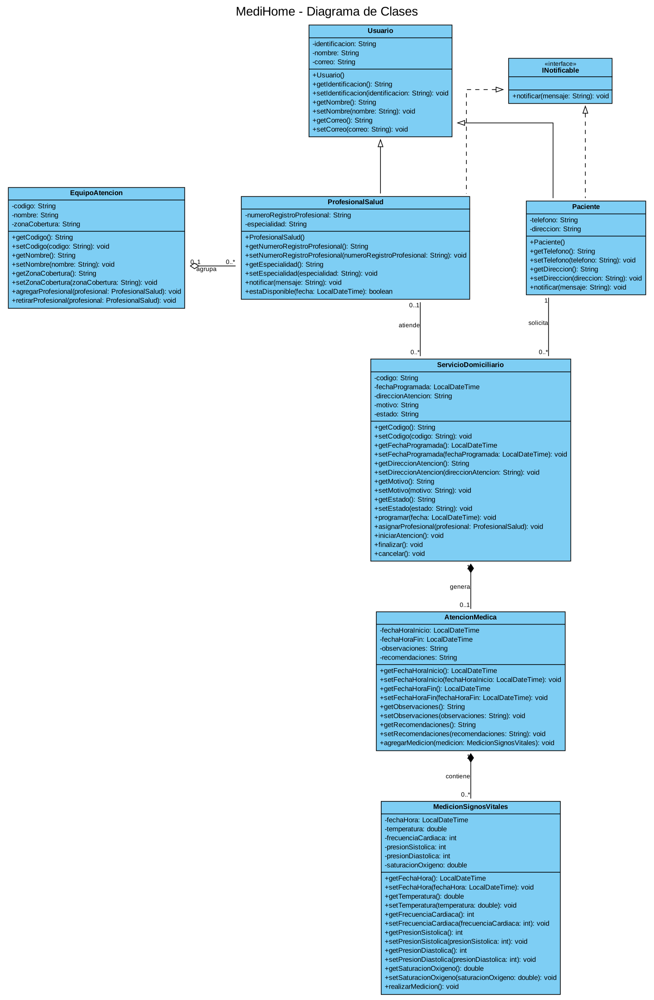

# MediHome – Sistema de Atención Médica Domiciliaria

Taller de **Diseño de Software** – Ingeniería de Software, Universidad Cooperativa de Colombia, Campus Pasto.

## Integrantes

| Nombre | Código |
|---|---|
| Laura Sofía Meza Reinoso | 922141 |
| Juan Diego Moreno | |

## Enunciado

MediHome es una empresa que presta atención médica domiciliaria y necesita un sistema para administrar sus servicios:

- Registra **pacientes** (identificación, nombre, correo, teléfono y dirección) y **profesionales de salud** (identificación, nombre, correo, número de registro profesional y especialidad). Ambos son **usuarios** del sistema y pueden recibir **notificaciones**.
- Un paciente puede solicitar varios **servicios domiciliarios** (código, fecha y hora programada, dirección, motivo y estado). Estados: `SOLICITADO`, `PROGRAMADO`, `EN ATENCION`, `FINALIZADO` y `CANCELADO`.
- Al programarse, a cada servicio se le asigna un profesional; un profesional puede atender varios servicios en fechas distintas.
- Durante el servicio el profesional registra una **atención médica** (inicio, fin, observaciones y recomendaciones), que existe solo como resultado del servicio.
- En la atención se registran 0 o varias **mediciones de signos vitales** (fecha y hora, temperatura, frecuencia cardiaca, presión sistólica, presión diastólica y saturación de oxígeno).
- Los profesionales se organizan en **equipos de atención** (código, nombre y zona de cobertura); un profesional puede cambiar de equipo sin dejar de existir.
- Todo elemento notificable ofrece una operación para recibir un mensaje (interfaz `INotificable`).

El enunciado original está en [`docs/Enunciado_ATENCION_MEDICA_DOMICILIARIA.docx`](docs/Enunciado_ATENCION_MEDICA_DOMICILIARIA.docx).

## Diagrama de clases

Diagrama elaborado en **Visual Paradigm**:


Diagrama completo con su **archivo fuente** en [`diagrama/MediHome_clases.dot`](diagrama/MediHome_clases.dot) (Graphviz). Aquí se ve completa la interfaz `INotificable`, que en la imagen de Visual Paradigm queda tapada por la marca de agua:



### Relaciones del modelo

| Relación | Tipo | Multiplicidad | Implementación en Java |
|---|---|---|---|
| `Paciente`, `ProfesionalSalud` → `Usuario` | Herencia | – | `extends Usuario` |
| `Paciente`, `ProfesionalSalud` → `INotificable` | Realización | – | `implements INotificable` (cada uno notifica a su manera: SMS / correo) |
| `EquipoAtencion` ◇— `ProfesionalSalud` (agrupa) | Agregación | 0..1 — 0..* | Lista de profesionales; `agregarProfesional` / `retirarProfesional` (el profesional sigue existiendo) |
| `Paciente` — `ServicioDomiciliario` (solicita) | Asociación | 1 — 0..* | Cada servicio guarda su paciente; el paciente guarda sus servicios |
| `ProfesionalSalud` — `ServicioDomiciliario` (atiende) | Asociación | 0..1 — 0..* | `asignarProfesional` valida disponibilidad con `estaDisponible(fecha)` |
| `ServicioDomiciliario` ◆— `AtencionMedica` (genera) | Composición | 1 — 0..1 | La atención solo la crea el servicio en `iniciarAtencion()` (constructor de paquete) |
| `AtencionMedica` ◆— `MedicionSignosVitales` (contiene) | Composición | 1 — 0..* | Lista interna de mediciones, `agregarMedicion(...)` |

## Estructura del repositorio

```
MediHome/
├── README.md
├── diagrama/
│   ├── MediHome_VisualParadigm.png   # Imagen del diagrama (Visual Paradigm)
│   ├── MediHome_clases.dot           # Fuente del diagrama (Graphviz)
│   └── MediHome_clases.png           # Imagen generada desde la fuente
├── docs/
│   └── Enunciado_ATENCION_MEDICA_DOMICILIARIA.docx
├── src/
│   ├── INotificable.java
│   ├── Usuario.java
│   ├── Paciente.java
│   ├── ProfesionalSalud.java
│   ├── EquipoAtencion.java
│   ├── ServicioDomiciliario.java
│   ├── AtencionMedica.java
│   ├── MedicionSignosVitales.java
│   └── Main.java
├── MediHome.iml                      # Proyecto IntelliJ IDEA
└── .idea/
```

## Ejecución

Requiere **JDK 17 o superior** (el proyecto está configurado con JDK 21).

**IntelliJ IDEA:** abrir la carpeta del proyecto y ejecutar `Main`.

**Consola:**

```bash
javac -encoding UTF-8 -d out src/*.java
java -cp out Main
```

## Flujo que ejecuta `Main`

1. Crea un **paciente** y un **profesional de salud** (y lo agrega a un equipo de atención).
2. El paciente solicita un **servicio domiciliario** → estado `SOLICITADO`.
3. Se programa la fecha y se asigna el profesional → estado `PROGRAMADO` (se notifica a ambos).
4. Se inicia la atención → el servicio crea la **atención médica** → estado `EN ATENCION`.
5. Se registra una **medición de signos vitales**, observaciones y recomendaciones.
6. Se finaliza el servicio → estado `FINALIZADO`.
7. Se imprime el **reporte de la atención** prestada al paciente.

## Salida del programa

```
======================================================================
                REPORTE DE ATENCIÓN MÉDICA DOMICILIARIA
======================================================================
SERVICIO
  Código            : SD-2026-0001
  Estado            : FINALIZADO
  Fecha programada  : 08/10/2026 09:00
  Dirección         : Calle 18 # 25-40, Barrio Las Cuadras, Pasto
  Motivo            : Fiebre persistente y malestar general desde hace 3 días
----------------------------------------------------------------------
PACIENTE
  Identificación    : 1085123456
  Nombre            : Carlos Andrés Rosero
  Correo            : carlos.rosero@correo.com
  Teléfono          : 3104567890
  Dirección         : Calle 18 # 25-40, Barrio Las Cuadras, Pasto
----------------------------------------------------------------------
PROFESIONAL DE LA SALUD
  Identificación    : 27456789
  Nombre            : Dra. María Fernanda Benavides
  Registro prof.    : RP-52-001234
  Especialidad      : Medicina General
  Equipo            : Equipo Domiciliario Centro (EQ-01) - Zona: Pasto - Comuna 1
----------------------------------------------------------------------
ATENCIÓN MÉDICA
  Inicio            : 08/10/2026 09:05
  Fin               : 08/10/2026 09:45
  Duración          : 40 minutos
  Observaciones     : Paciente consciente y orientado. Febril, con congestión nasal y odinofagia leve. ...
  Recomendaciones   : Acetaminofén 500 mg cada 8 horas por 3 días, abundante hidratación y reposo. ...
----------------------------------------------------------------------
SIGNOS VITALES (1 medición(es))
  #1 - 08/10/2026 09:12
     Temperatura          : 38.4 °C
     Frecuencia cardiaca  : 96 lpm
     Presión arterial     : 128/84 mmHg
     Saturación oxígeno   : 95.0 %
======================================================================
```

> Los datos del paciente y del profesional son ficticios, usados solo para la demostración.
